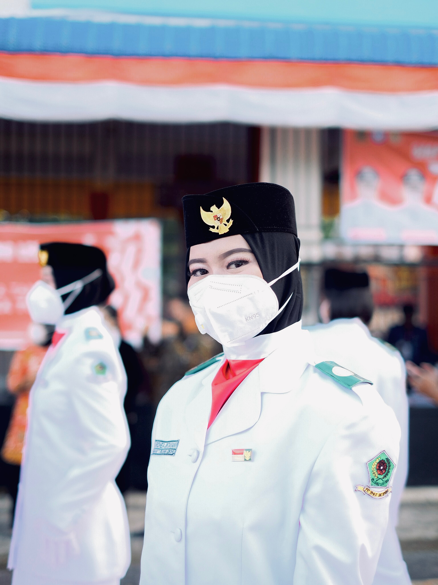

!DOCTYPE html>
<html lang="en">
<head>
    <meta charset="UTF-8">
    <meta name="viewport" content="width=device-width, initial-scale=1.0">
    <title>Profil Mahasiswa</title>
    
</head>
<body>

    <h1>Profil Mahasiswa</h1>

    

        
        
<strong>NIM :</strong> 225410066

        
<strong>Nama :</strong> Ardhea Oktaviany

		
<strong>Nama Korea :</strong> Park Kyung-Lee

		
<strong>email :</strong> ardhea.cs88@gmail.com

    

</body>
</html>
